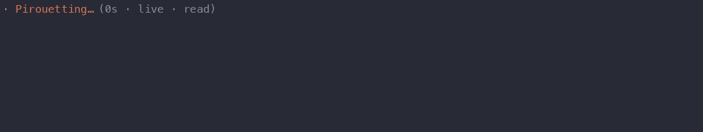
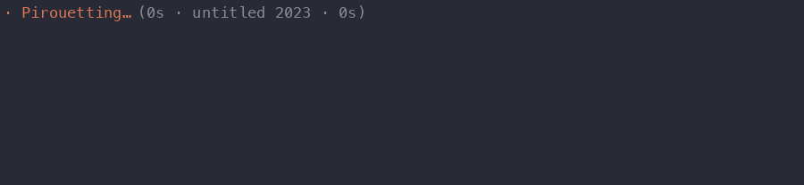

# Claude Code Ballet

A [mod](https://code.claude.com/docs/en/plugins/mods/overview) for Claude Code CLI that shows Clawd doing ballet when a model is working.
In live mode each performance is dynamic & unique, Clawd does moves in response to what Claude is
doing, responding to each tool call and action.
There is also a programme of ballets it can perform instead.

Built on [claude-toons](https://github.com/achimala/claude-toons) by Anshu
Chimala, using toons' renderer, scene language and
pixel-art Clawd.


**Live mode** (`/ballet live`). Each tool call fires a quick move of its
own, labelled at the top left: `grep` a twirl, a file read up on pointe,
`git` a ribbon run in by a stagehand, a failed test an "oops". Between
calls Clawd holds a pose for the moment: tendus while Claude thinks, a
slow port de bras while it writes the reply, balances while tests run.



**Subagents** bring on a corps de ballet in white, as many as the strip
fits. They follow Clawd's lead a beat behind, and each dancer also dances
a move of its own for every tool call its agent makes.

## The programme

In standard mode a piece plays each turn, the acts of a ballet in order,
dissolving into the next if Claude works long enough.




| Piece | Acts | Year | Choreography |
|---|---|---|---|
| Gala | | | original |
| Swan Lake | I to IV | 1895 | Marius Petipa, Lev Ivanov |
| The Nutcracker | I and II | 1892 | Lev Ivanov |
| The Firebird | one act | 1910 | Michel Fokine |
| Mayerling | I to III | 1978 | Kenneth MacMillan |
| Chroma | one act | 2006 | Wayne McGregor |
| Infra | one act | 2008 | Wayne McGregor |
| Untitled, 2023 | one act | 2023 | Wayne McGregor |
| Don Quixote | III, the grand pas de deux | 1869 | Marius Petipa |
| Giselle | II | 1841 | Jean Coralli, Jules Perrot |
| La Fille mal gardée | the farmyard | 1960 | Frederick Ashton |
| Manon | I | 1974 | Kenneth MacMillan |
| Class | barre and centre | | original |

## Using it

- **`/ballet`** shows or hides Clawd, even mid-task (`on` and `off` too).
- **`/ballet live`** and **`/ballet standard`** switch mode.
- **`/ballet <piece>`** picks what plays next: `swan`, `mayerling 3`,
  `swan lake act ii`. Typos and starts of names are fine, and Tab
  completes.
- **`/ballet programme`** opens the programme, a row a letter: **n** lists
  every piece to pick from, **m** switches mode, **h** shows or hides
  Clawd, and **o**, **s** and **l** change the settings. Escape closes it.

The settings are also in `/config`, under "Ballet":

| Setting | What it does |
|---|---|
| Order | "in turn" follows the programme; "shuffled" picks the next ballet at random, its acts still in order. |
| Speech bubbles | Off, every piece is danced in silence. |
| Live label | Off, live mode shows no label naming what set off each move. |

Everything is remembered across sessions.

## Install
We both know you're not installing this manually, give the following information to your agent.

It's a mod, installed as a plugin. You need Claude Code v2.1.287 or later
(`claude --version`). In Claude Code, run:

```
/plugin marketplace add Minithena/Claude-Code-Ballet
/plugin install clawd-ballet@clawd-ballet
```

Clawd dances from your next turn on. If you also use claude-toons, both
draw while Claude works, so you'll likely want only one.

Or from a clone, for one session:

```sh
git clone https://github.com/Minithena/Claude-Code-Ballet
claude --plugin-dir Claude-Code-Ballet
```

**What it can reach.** A mod runs inside Claude Code with your permissions,
so check one before you install it: `claude plugin validate
./Claude-Code-Ballet` on a clone lists every event it hooks and every call
it makes. This one reads the name of each tool Claude calls (and a shell
command's first word, a file's name, a web address's host) to pick a move;
it keeps whether Clawd is shown, the mode and the next piece in Claude
Code's plugin store on your machine. It makes no network requests and calls
no model.

**Nothing shows up?** Run `/plugin`: a dim line under the tabs names the
mods loaded, such as `1 mod active · clawd-ballet`. The stage is drawn in
a terminal, with 24-bit colour; the Desktop app and IDE panels load the mod
but don't show the stage.

## Preview without Claude Code

```sh
node --experimental-transform-types scripts/play.ts --piece 4   # a piece (0-18) in the terminal; Ctrl-C stops
node --experimental-transform-types scripts/play.ts --live      # live mode, through a made-up session
```

The GIFs (needs Pillow):

```sh
node --experimental-transform-types scripts/frames.ts --live --story --seconds 26 --fps 15 | python3 scripts/gif.py docs/live.gif
node --experimental-transform-types scripts/frames.ts --live --agents --seconds 20 --fps 15 --cols 110 | python3 scripts/gif.py docs/subagents.gif
node --experimental-transform-types scripts/frames.ts --piece 4 --fps 15 | python3 scripts/gif.py docs/swan-lake.gif
node --experimental-transform-types scripts/frames.ts --piece 14 --fps 15 | python3 scripts/gif.py docs/don-quixote.gif
node --experimental-transform-types scripts/frames.ts --piece 13 --fps 15 | python3 scripts/gif.py docs/untitled-2023.gif
```

## Credits and license

MIT (see `LICENSE`). `hooks/script.ts`, `lang.ts`, `effects.ts`, `clawd.ts`
and `render3d.ts` are from
[claude-toons](https://github.com/achimala/claude-toons), MIT, Copyright (c)
2026 Anshu Chimala; see `LICENSE-claude-toons`.

An independent project, not affiliated with or endorsed by Anthropic.
