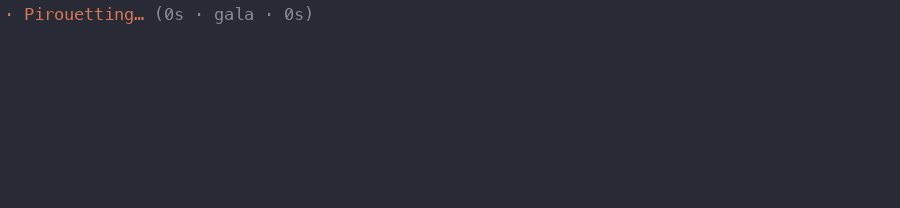
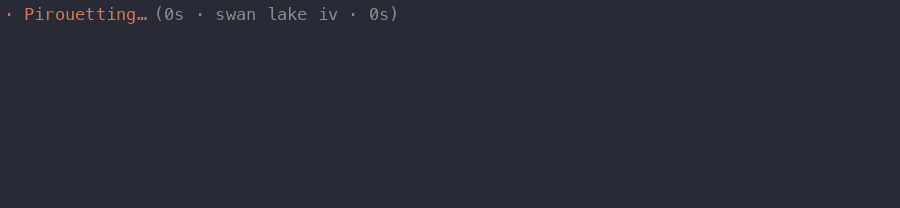
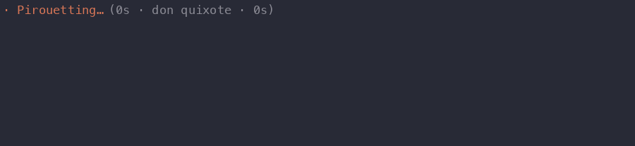
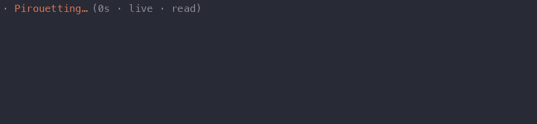

# ballet-clawd

Clawd, the Claude Code mascot, in a pink tutu as on its ballet sticker,
dancing a little ballet on a little stage just above the prompt while Claude works. It is a
[claude-toons](https://github.com/achimala/claude-toons) scene, drawn by
toons' own renderer, so it looks and moves like toons: the same Clawd, the
same faint animated backdrop, the same speech bubbles. But it's one
choreographed scene instead of a director model, so it makes no requests and
costs nothing.



Nineteen pieces take turns, the acts of each ballet in order (Swan Lake
in four, the Nutcracker in two, Mayerling in three, a Wayne McGregor
triple bill), one per turn, each dissolving into the next if
Claude works long enough:

- **Gala**: a stage with velvet curtains and a spotlight. The curtains
  part, a bourrée in from the wing, the count-in, pliés and port de bras, triple pirouettes, a
  développé, grand jetés across the stage, an arabesque, and a révérence as
  roses land at Clawd's feet, and the curtains close.
- **Swan Lake**, in four acts. I: the palace garden at dusk, the
  prince's birthday, a pas de trois, a crossbow, his slow solo, and swans
  flying over for him to chase. II: the lake at midnight (below). III: the
  ball; Odile, the black swan, in an adagio her father works like a
  puppet, her 32 fouettés, the prince swears to the
  wrong swan. IV: the lake before dawn; the swans mourn in unison,
  forgiveness, Rothbart's owl in a storm, and a lift into the sunrise for
  a happy ending. Act II: The swan glides in with its arms
  beating like wings, holds an arabesque, turns, and the little swans dance
  in a line, arms linked (on a wide enough strip). Then the dying swan, as
  von Rothbart's owl crosses the moon... who feels better.
- **Nutcracker**, in two acts. I: Christmas Eve; Clara waltzes,
  Drosselmeyer's gift, midnight, the tree growing, the mice and their
  king, Clara's little jumps at them and her slipper, the prince, and a
  pas de deux in the snow. II: snow falling by a lit tree. The Sugar Plum Fairy turns
  across the stage, jumps, développés, leaps and does fouettés.
- **Firebird**: the enchanted garden at night, by the tree of golden
  apples. The Firebird flies in trailing embers, steals an apple, is caught,
  leaves a feather, dances the infernal dance (turns, a tour en l'air,
  entrechats), sings the lullaby and flies off.
- **Mayerling**, in three acts. I: the wedding ball at the Hofburg,
  chandeliers and parquet; Rudolf (in breeches and boots) and Princess
  Stephanie bow and waltz, she twirls under his arm, and he turns his back
  and dances alone. II: Mitzi Caspar's tavern; the Hungarian officers
  stamp, clap and turn in the air together, Mitzi dances among them and
  with Rudolf, and laughs off his talk of dying. III: the hunting lodge,
  green velvet and candlelight; Mary Vetsera (in ivory) and Rudolf: the
  pull, her turns in his arms, her flight and return, and the enveloping
  kiss, Mary held upside down above Rudolf on his knees. The lights close
  in and go to black; they come up on the two of them grinning, a bottle
  and a glass raised, and... pop! Champagne. Just kidding, they're fine.
- **Wayne McGregor**, a triple bill. Chroma: John Pawson's white room,
  sharp snapping phrases, a duet pulling off balance, canon. Infra: Julian
  Opie's LED walkers along the top, couples in boxes of light, a crowd
  walking past one woman crying until one stops. Untitled, 2023: Carmen
  Herrera's white canvas cut with green, a trio in green and cream,
  frozen, slow, a burst, one long slow turn. (McGregor's extreme lines
  are beyond Clawd's block of a body, so it's in the staging.)
- **Don Quixote**, act III: Kitri and Basilio's wedding pas de deux in a
  square in Barcelona at sunset, bunting overhead and Don Quixote's
  windmill on the hill. The entrée; the adagio (a supported double, his
  one-armed lift, her long balance once he lets go); his variation of
  tours and jumps; hers, hopping on pointe with her fan; the coda (his
  tours, her fouettés while the windmill spins to keep up); a last lift,
  and ole.
- **Giselle**, act II: midnight by Giselle's grave, mist on the ground and
  the Wilis drifting in the dark. She rises out of her grave, whirls at
  Myrtha's command, hops in arabesque; Albrecht walks in with lilies and
  they dance, she floating up in his arms; the Wilis make him beat
  entrechats while she dances beside him to keep him going, until she
  leads them off. Dawn saves him: one last lift, and she bourrées back to
  her grave and sinks under the mist.
- **La Fille mal gardée**: a farmyard at first light, opening with the
  chicken dance: the Cockerel struts in and crows, the Hens (white tutus,
  red combs, orange pointe shoes) follow him flapping, peck in canon (a
  pas de chat, an arabesque tipped forward) and jump while he turns in the
  air. Then Lise leaps in, turns, hops in arabesque and ties a pink ribbon
  for Colas; they dance with it between them (she turns in it, drives him
  across the yard with it like reins, they skip), she whirls
  round the yard in piqué turns, and Widow Simone's clogs send Colas
  running.
- **Manon** (Kenneth MacMillan), act I: the inn yard at Amiens. The coach
  brings Manon; Des Grieux looks up from his book and dances his solo for
  her (tours, pirouettes, down on one knee) while she sways and answers in
  arabesque; their first pas de deux, lifts and a waltz; he tries to write
  to his father and she teases him off it; pirouettes, a last lift, and
  the coach takes them both to Paris.
- **Class**: the studio barre, with the teacher counting from the piano,
  its metronome ticking. Pliés, kicks, a
  balance, then pirouettes, sautés and a bow in the center.





**Live** (`/ballet live`) is the other mode: one Clawd in the studio whose
dancing is made of what Claude does, as claude-toons' scenes follow the
work. Between tool calls Clawd holds still, in a pose for the moment:
light tendus and élevés, thought bubbles rising, while Claude thinks; a slow, calm port de bras while it writes the reply; held in
balances while tests run, passés while a build does, sitting with z's
through a `sleep`. Each tool call or shell command fires one quick move,
about a second, and calls in quick succession chain their moves
together into one piece. A label at the top left says what set off the
move in hand (`grep`, `read live.ts`, `git log`), and between moves what
Claude is at (thinking, writing the reply, tests running):



- **Reading** a file: up on pointe, the arms opening. `cat` a pas de chat,
  `head` reaching up, `tail` an arabesque and a look back, `wc` three
  counted jumps, `diff` a glance in the mirror.
- **Searching**: `grep` a quick twirl, `rg` a double, a glob or `find`
  turning across the studio to the thing (!), `ls` pointing this way and
  that, `pwd` a turn looking all round.
- **Editing**: a beaten jump; a new file a grand jeté; `rm` a kick sending
  a paper ball into the wings; `mv` a glissade; `cp` a pose and its copy
  the other way; `mkdir` and `touch` down to the floor and up with a
  spark; `chmod` and `sudo` a curtsy to the piano; `tar` and `zip`
  squashed small and out again.
- **Other commands**: a double pirouette; `echo` singing; `kill` the dying
  swan (who gets up again); `cd` a glissade; `sort` chassés; `open` a
  presentation; `ssh` a leap off into the wings and back from the other
  side.
- **git**: a stagehand runs in with a ribbon on a wand and Clawd twirls
  with it; the ribbon, a twisting pink band, circles Clawd on its turns and
  streams after every move for a few seconds. A **commit**
  or **push**: a sparkling révérence.
- **The web**: a messenger runs in with a letter; Clawd jumps for it and
  reads it overhead.
- **An MCP server**: a partner (each server its own colour) walks on and
  lifts Clawd, partners its turns while the server's in use, and bows out
  as soon as it's done.
- **Subagents**: a corps in white joins, as many as the strip has room
  for, dancing Clawd's moves a beat behind, and each dancer a move of its
  own whenever its agent uses a tool.

A new task begins with a preparation; a tool that fails sends Clawd off
balance ("oops"); tests or a build that pass get a double tour and
sparkles. Clawd carries on from turn to turn rather than starting a
piece. Like the pieces, it asks no model and costs nothing.

Clawd is drawn as on the official stickers (the ballet one above all):
the same block, two arm stubs and four little legs, a pink checked tutu,
and three-quarter views with the far side in shade when it turns. Now and
then it says something in a speech bubble (a title, a story beat, a
joke), a little differently each time round. Some pieces have weather
and lights behind them: stars over the lake, rain in Swan Lake's storm,
confetti over the gala's bow, fireworks over Barcelona. A frame takes
about a millisecond to draw.

An independent project, not affiliated with or endorsed by Anthropic.

## Install

You need Claude Code in a terminal with plugin hook modules, an
early-access feature (built against 2.1.288). In Claude Code, run:

```
/plugin marketplace add Minithena/ballet-clawd
/plugin install ballet-clawd@ballet-clawd
```

Clawd dances from your next turn on. If you also use claude-toons, both
would draw while Claude works, so you'll likely want only one.

**From a clone instead**, for one session:

```sh
git clone https://github.com/Minithena/ballet-clawd
claude --plugin-dir ballet-clawd
```

**Nothing shows up?** Run `claude --debug` and look for a `ballet-clawd`
line. If it says hook modules are turned off, your Claude Code doesn't have
the feature switched on yet. It draws in the terminal only, not in the
desktop app or an IDE panel, and wants a terminal with 24-bit colour.

## Using it

- **`/ballet`** shows or hides the dancer, even mid-task. `/ballet on` and
  `/ballet off` also work. The choice is remembered across sessions.
- **`/ballet gala`**, **`swan`**, **`nutcracker`**, **`firebird`**,
  **`mayerling`**, **`chroma`**, **`infra`**, **`untitled`**, **`don`**,
  **`giselle`**, **`fille`**, **`manon`** or **`class`**
  picks the piece the next turn starts with. A ballet in acts starts at its
  first act; add the act to start there: `/ballet mayerling 3`,
  `/ballet swan lake act ii`. Typos and starts of names are fine
  (`/ballet mayerlinf`, `/ballet nut 2`); words that name no piece get a
  list of what there is and leave the ballet as it was.
- **`/ballet live`** switches to the live dancer, and **`/ballet
  standard`** (or naming a piece) back to the ballets in turn. The mode is
  remembered across sessions.
- **`/ballet programme`** (or `settings`) opens the programme, a row a
  letter: **n** lists every piece, each with a letter to pick it by (0
  goes back), **m** switches mode, **h** shows or hides Clawd, and **o**,
  **s** and **l** change the settings. Escape closes it.
- While you type `/ballet ...`, a dim row above the prompt shows what it
  can complete to, and **Tab** (or → at the end) completes it; Tab again
  steps to the next match.

The settings are also in `/config`, under "Ballet":

| Setting | What it does |
|---|---|
| Order | "in turn" follows the programme; "shuffled" picks the next ballet at random, its acts still in order. |
| Speech bubbles | Off, every piece is danced in silence. |
| Live label | Off, live mode shows no chip naming what set off each move. |

## Preview without Claude Code

```sh
node --experimental-transform-types scripts/play.ts --piece 1   # plays a piece (0-18) in the terminal; Ctrl-C stops
node --experimental-transform-types scripts/play.ts --live      # the live dancer, through a made-up session
node --experimental-transform-types scripts/frames.ts --piece 0 | python3 scripts/gif.py docs/demo.gif   # needs Pillow
node --experimental-transform-types scripts/frames.ts --live --seconds 30 --fps 15 | python3 scripts/gif.py docs/live.gif
node --experimental-transform-types scripts/frames.ts --piece 4 --fps 15 | python3 scripts/gif.py docs/swan-lake.gif
```

## License

MIT (see `LICENSE`). `hooks/script.ts`, `lang.ts`, `effects.ts`, `clawd.ts` and `render3d.ts`
are from claude-toons, MIT, Copyright (c) 2026 Anshu Chimala; see
`LICENSE-claude-toons`.
